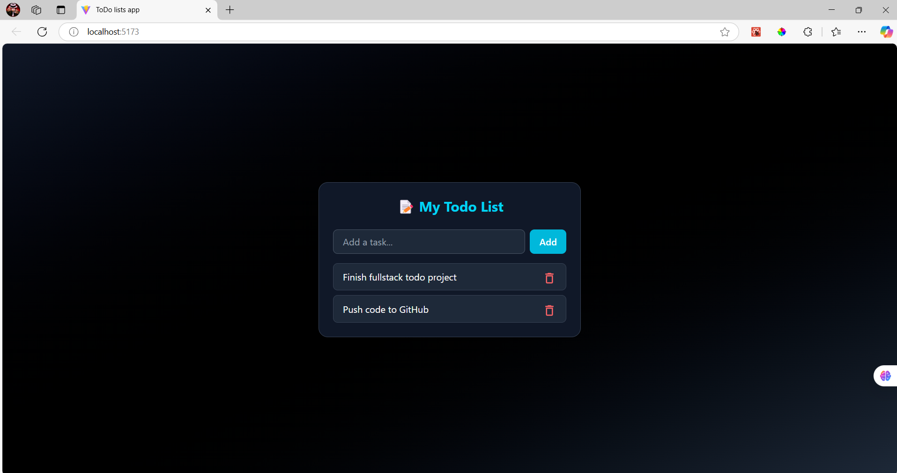
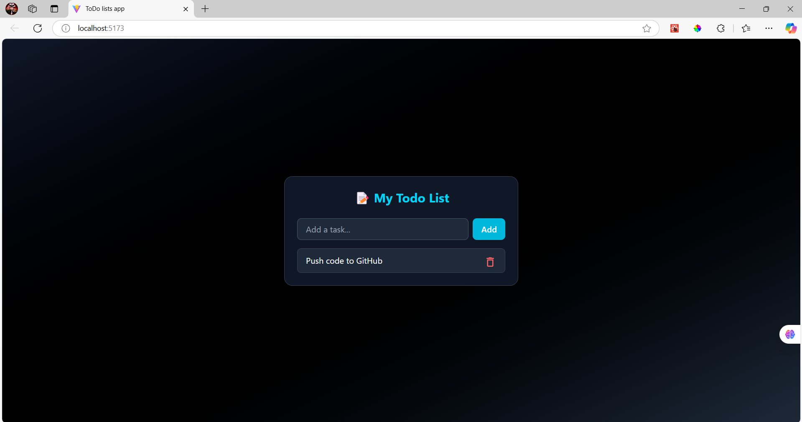

# 📝 Fullstack Todo App

A minimal and modern fullstack Todo app built with **Express**, **MongoDB**, **React**, and **Tailwind CSS**.

## 📦 Tech Stack

- **Frontend:** React + Vite + Tailwind CSS
- **Backend:** Node.js + Express
- **Database:** MongoDB Atlas

---

## 🔧 Features

- Add todos 🆕
- View all todos 📋
- Delete todos ❌
- Sleek UI with Tailwind 🌈

---

## 📁 Folder Structure

```yaml
todo-app/
├── backend/
│   ├── models/
│   │   └── Todo.js
│   ├── .env
│   ├── server.js
│   └── package.json
├── frontend/
│   ├── src/
│   │   ├── assets/icon.png
│   │   ├── App.jsx
│   │   ├── index.css
│   │   └── main.jsx
│   ├── .env
│   ├── .gitignore
│   ├── eslint.config.js
│   ├── index.html
│   ├── README.md
│   └── vite.config.js
│   └── tailwind.config.js
│   └── package.json
```

## 🚀 Getting Started

### 1. Clone the repository

```bash
git clone https://github.com//todo-app.git
cd todo-app
```

### 2. Setup Backend

```bash
cd backend
npm install
```

### Create a .env file in the backend folder:

```bash
MONGO_URI= your-mongodb-atlas-uri
PORT=3000
```

### Run the server:

```bash
nodemon server.js
//or
node server.js
```

## 3. Setup Frontend

```bash
cd ../frontend
npm install
```
### Run the server:

```bash
npm run dev
```

## 🌐 API Endpoints

| Method | Endpoint | Description       |
|--------|----------|-------------------|
| GET    | /todos   | Get all todos     |
| POST   | /todos   | Add a new todo    |
| DELETE | /todos/  | Delete a todo     |


## ✨ UI Preview

Optional: Add a screenshot here

  

